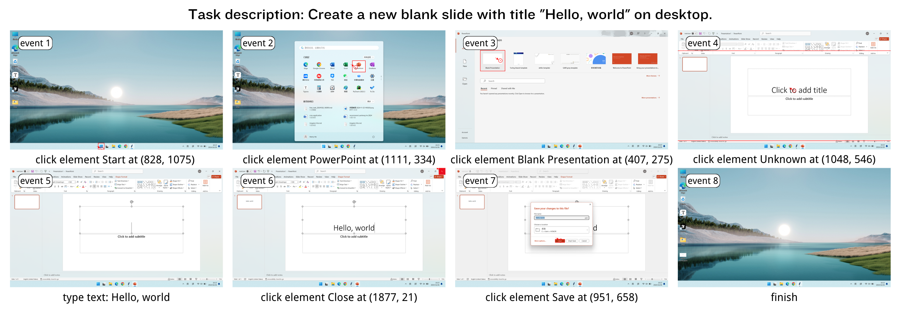

# PC Tracker User Manual

- Version: 1.0
- Last updated: 2024-12-05

## 1. Introduction

PC Tracker is a lightweight infrastructure for efficiently collecting large-scale human-computer interaction trajectories. The program runs seamlessly in the background, automatically capturing screenshots and keyboard & mouse activities. 

Below is an example of the collected human-computer interaction trajectories:

## 2. Installation

- Ensure your operating system is Windows 10 or higher.
- Extract our software package to a location with sufficient disk space (recommended to have more than 3G of available space for storing recorded data).

## 3. Quick Start

- [Optional] Set screen resolution to 16:9 (recommended 1920 x 1080).
- Open the extracted folder and launch main.exe.

## 4. Instructions

After starting the software, you can choose between `Task Oriented Mode` or `Non-Task Oriented Mode` for recording.

### Task Oriented Mode

This mode is divided into two sub-modes: `Given Task` and `Free Task`.

#### Given Task

In `Given Task` mode, you will be assigned an uncompleted task each time.

- **Next Task**: Click `Next Task` to get the next task.
- **Previous Task**: Click `Previous Task` to return to the next task.
- **Bad Task Feedback**: If you think the current task is unsuitable for annotation or cannot be completed, click `Bad Task` to provide feedback, and this task will be permanently discarded. However, if you think the task can be modified, you can modify the task description after finishing the task.

- **Set Execution Environment**: If needed, you can set some preconditions before starting the recording. For example, if you are assigned the task "Zoom in on the current page to 150% in Chrome," you can open Chrome first, then start recording, and perform the task in Chrome to ensure the recorded data is accurately related to the task.
- **Start Recording**: Click `Start`, and the software page will automatically minimize, after which recording will begin.
- **Minimize Software**: To reduce interference from the front-end page appearing in screenshots, **ensure the software is minimized during each task-related operation**. If you forget the task details during execution, you can reopen OS Tracker to read the task description, but please minimize it again before continuing. We will remove these "open software" and "minimize software" operations during data post-processing.
- **Finish Task**:
  - If the task is completed, open the software and click `Finish`, and this operation process will be recorded, and the task will not appear again. You can choose to modify the task description after clicking `Finish`.
  - If you do not want the operation data to be recorded, or if the task execution fails, click `Fail`, and then choose whether to discard the operation process.

**Operations on Given Files**

Some tasks may involve operations on given files, all of which should be placed in the distributed `./files` folder. For example:

Run the 'hello.py' file in Visual Studio Code.

In this case, you should run `./files/hello.py` in Visual Studio Code.

You do not need to worry about your operations changing the state of files in the `./files` folder, as it will be automatically reset at the start of each recording.

#### Free Task

In `Free Task` mode, you can freely use the computer and summarize the task description and difficulty (easy / mediate / hard) yourself.

- **Summarize This Record**: After filling in the task description and selecting the task difficulty, click `Save` to save the record.
- **Discard This Record**: Click `Discard` to discard the record.

### Non-Task Oriented Mode

In this mode, you can freely use the computer and choose when to start and stop recording.

## 5. Precautions

- **Does not currently support using extended screens**.
- **Does not currently support using Chinese input methods**.
- **Does not currently support using touchpads**.

## 6. Data Privacy

- After starting recording, your screenshots and keyboard & mouse operations will be automatically recorded. PC Tracker does not record any information from unopened software. If you believe the recording may infringe on your privacy, you can choose to discard the record.
- Collected data will be saved in the `./events` folder (hidden by default). Each trajectory comes with a Markdown file for easy visualization.

## 7. FAQ

**1. Does the software have networking capabilities?**

PC Tracker is completely local, does not support networking, and will not upload your data.

**2. What if my computer screen resolution is not 16:9?**

If your screen resolution is not 16:9, it will affect the subsequent unified processing of data. We recommend adjusting your screen resolution to 16:9.

**3. How much space will the collected data approximately occupy?**

The specific data size varies. Generally, even with intensive recording operations for 1 hour, it will not generate more than 1G of data.

## 8. Contact

- If you have any questions, please contact us at henryhe_sjtu@sjtu.edu.cn or zizi0123@sjtu.edu.cn.
